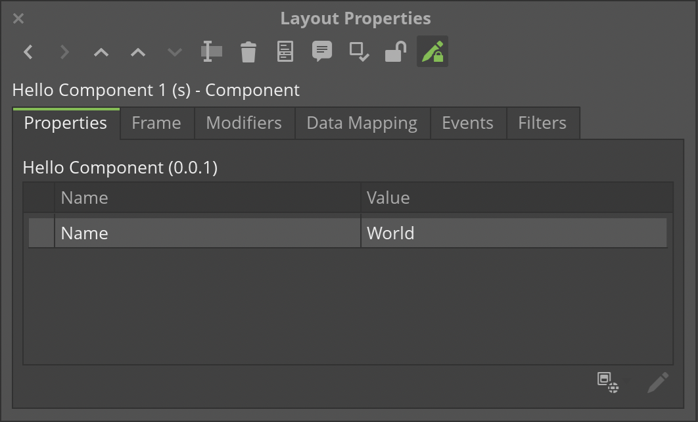

# Hello World DC Component

> A sample component for use with Dynamic Communications in Quadient® Inspire.

## Usage

This project is intended to serve as a simple example of a custom Dynamic Communication (DC) component. It's only function is to display the typical "Hello, World!" message.

To use the component:

1. Install Quadient® Inspire Designer R12 or higher.

2. Clone the repo into the `${INSPIRE-ROOT}/DCComponents/Components` directory.

```sh
git clone https://github.com/robertwtucker/dc-hello.git
```

3. Open Designer and create a new Dynamic Communication.

4. Add the **Hello** component to the Dynamic Communication and modify the **Name** property, if desired, in the *Layout Properties* dialog (shown below).



## License

Distributed under the MIT License. See `LICENSE` for more information.

## Contact

Robert Tucker - [@robertwtucker](https://twitter.com/robertwtucker)

Project Link: [https://github.com/robertwtucker/dc-hello](https://github.com/robertwtucker/dc-hello)